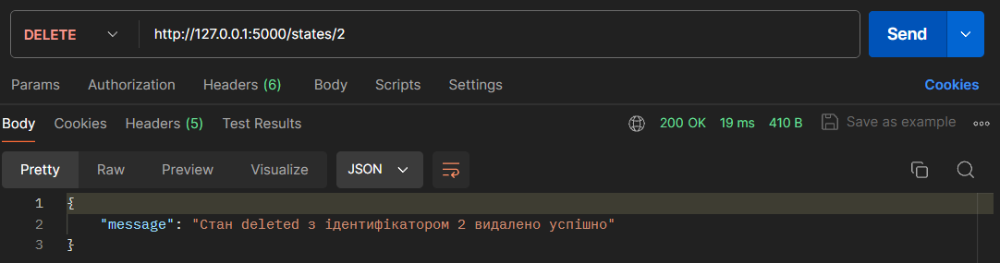

# Тестування працездатності системи

## Засоби тестування
Тестування CRUD застосунку проводиться за допомогою online Postman.

Примітка: Перед цим необхідно інсталювати Postman, щоб тестувати запроси на локальному сервері.

### Отримання інформації по всім States

### Створення нового стану

### Оновлення стану

### Видалення стану

### Фінальна таблиця після всіх маніпуляцій

